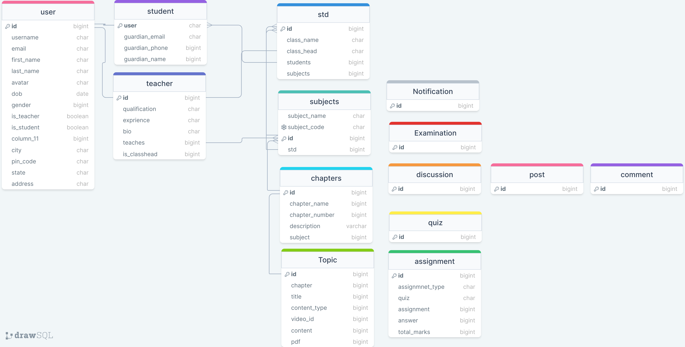

<a name="readme-top"></a>

<!-- PROJECT LOGO -->
<br />
<div align="center">

  <h1>Dashboard</h1>
  <p align="center"> 
   A Learning Management System, that enhances the Learning experience of k-12 students. 
    <br />
    <br/>
    <a href="http://alokraj71841.pythonanywhere.com/">Live Site</a>
    ·
    <a href="https://github.com/ankitdevelops/dashboard/issues">Report Bug</a>
    ·
    <a href="https://github.com/ankitdevelops/dashboard/issues">Request Feature</a>
  </p>
</div>

<!-- TABLE OF CONTENTS -->
<details>
  <summary>Table of Contents</summary>
  <ol>
    <li>
      <a href="#about-the-project">About The Project</a>
      <ul>
        <li><a href="#built-with">Built With</a></li>
      </ul>
    </li>
    <li>
      <a href="#getting-started">Getting Started</a>
      <ul>
        <li><a href="#prerequisites">Prerequisites</a></li>
        <li><a href="#installation">Installation</a></li>
      </ul>
    </li>
     </ol>
</details>

<!-- ABOUT THE PROJECT -->

## About The Project

 <a href="http://alokraj71841.pythonanywhere.com/">
    
  </a>

 A Learning Management System, that enhances the Learning experience of k-12 students. This project aims to equip our schools with latest tech, so that students are not left behind.

<p align="right">(<a href="#readme-top">back to top</a>)</p>

## Built With


**_DB DESIGN_** _this db is not fully implemented_
 

<p align="right">(<a href="#readme-top">back to top</a>)</p>

<!-- GETTING STARTED -->

## Getting Started

To get a local copy up and running follow these steps.

### Prerequisites

You need  `Python` installed on your machine.

### Installation

 Clone the repo
   ```sh
   git clone https://github.com/ankitdevelops/dashboard.git
   ```
 **create a virtual environment, you can use any method to create virtualenv**
   ```sh
   virtualenv env
   ```

**Install the required dependencies from requirements.txt file**

```sh
pip install -r requirements.txt

```
Start the Django Development Server

```sh
python manage.py collectstatic #only if needed
python manage.py makemigrations #only if needed
python manage.py migrate #only if needed
python manage.py runserver
```
<p align="right">(<a href="#readme-top">back to top</a>)</p>


### Login Credentials

**Admin**
username:ankit
password:ankit

**Teacher**
username: Vipin -1998-05-25
password: Vipin -1998-05-25

**Student**
username: Rylee-2024-02-20
password: Rylee-2024-02-20


